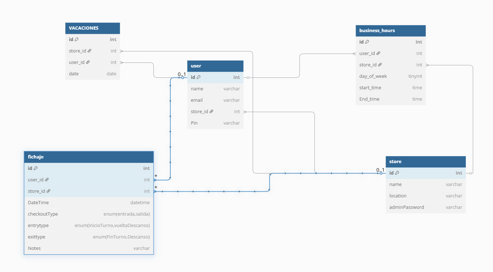
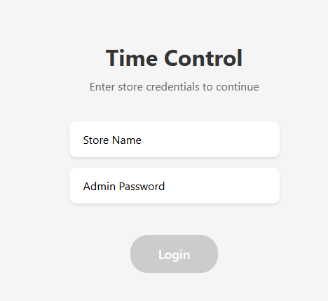
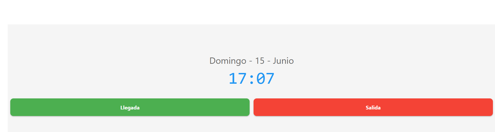
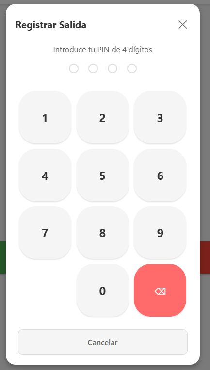
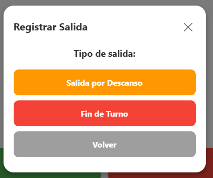
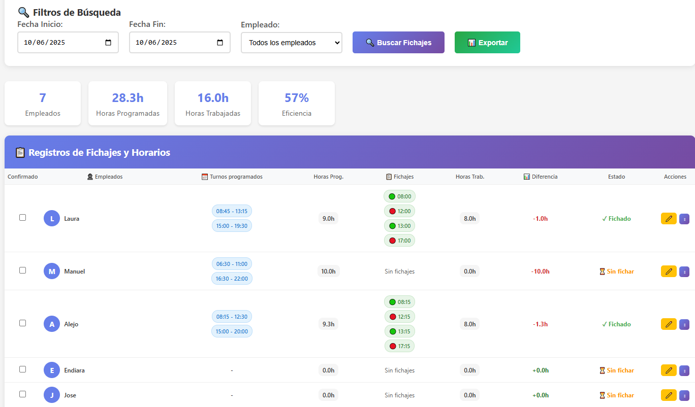

# Sistema de Control Horario para Salones – Integrado con TPV PeluqueriaUnida

*App móvil desarrollada con Expo y React Native enfocada en la gestión del tiempo, basada en tareas y productividad.*

## Índice

* [1. Introducción 📖](#1-introducción-)
* [2. Justificación y motivación del proyecto 🧠](#2-justificación-y-motivación-del-proyecto-)
* [3. Objetivos del proyecto 📦](#3-objetivos-del-proyecto-)
* [4. Identidad visual e imagen corporativa 🎨](#4-identidad-visual-e-imagen-corporativa-)
* [5. Estudio de mercado 📊](#5-estudio-de-mercado-)
* [6. Presupuesto estimado 💰](#6-presupuesto-estimado-)
* [7. Análisis y especificación de requisitos ⌨️](#7-análisis-y-especificación-de-requisitos-️)
  * [7.1 Requisitos funcionales](#71-requisitos-funcionales)
  * [7.2 Requisitos no funcionales](#72-requisitos-no-funcionales)
  * [7.3 Casos de uso](#73-casos-de-uso)
* [8. Manual de instalación 🔧](#8-manual-de-instalación-)
* [9. Uso de la herramienta ⚙️](#9-uso-de-la-herramienta-)
* [10. Documentación técnica adicional 📑](#10-documentación-técnica-adicional-)
* [11. Pruebas realizadas y validación 🔍](#11-pruebas-realizadas-y-validación-)
* [12. Planificación 🔩](#12-planificación-)
* [13. Gestión de la información y datos 🖇️](#13-gestión-de-la-información-y-datos-)
* [14. Mejoras futuras y ampliaciones 🧩](#14-mejoras-futuras-y-ampliaciones-)
* [15. Conclusiones 💭](#15-conclusiones-)
* [16. Manual de usuario 📘](#16-manual-de-usuario-)
* [17. Bibliografía/Webgrafía 📚](#17-bibliografíawebgrafía-)
* [18. Otros ❕](#18-otros-)
  * [18.1 Autor ✒️](#181-autor-)
  * [18.2 Licencia 📄](#182-licencia-)
  * [18.3 Agradecimientos 🎁](#183-agradecimientos-)

---

### 1. Introducción 📖

Este proyecto es una aplicación móvil creada con [Expo](https://expo.dev) y React Native. El objetivo es ofrecer una herramienta para gestionar el tiempo del usuario, enfocándose en la productividad mediante técnicas como el seguimiento de tareas y control de sesiones.

Utiliza navegación basada en archivos mediante `expo-router`, almacenamiento local con `@react-native-async-storage/async-storage`, y otros componentes modernos de la suite Expo.

---

### 2. Justificación y motivación del proyecto 🧠

La gestión del tiempo es un desafío constante para los salones, especialmente aquellos con recursos limitados o equipos pequeños. Este proyecto nace como un **módulo integrado del sistema TPV PeluqueriaUnida**, una solución gratuita ya orientada a este sector.

La motivación principal es **cubrir un hueco real en el mercado**: ofrecer a los salones una herramienta de control horario moderna, intuitiva y adaptada a sus necesidades, sin costes adicionales ni complicaciones técnicas.

La aplicación no solo facilita el control de horarios y turnos, sino que incluye elementos humanos como la **felicitación automática de cumpleaños** a miembros del equipo, reforzando el trato personalizado que caracteriza al sector.

---

### 3. Objetivos del proyecto 📦

* Brindar a los salones una herramienta intuitiva e integrada con el TPV PeluqueriaUnida para gestionar el tiempo y los fichajes del equipo.

* Simplificar el control de turnos, vacaciones y horarios sin necesidad de servicios externos ni conocimientos técnicos avanzados.

* Desarrollar la app con tecnologías móviles modernas (Expo + React Native + TypeScript) para asegurar su portabilidad y mantenimiento.

---

### 4. Identidad visual e imagen corporativa 🎨

El proyecto **TFC** presenta una imagen visual coherente con su propósito: productividad y simplicidad.  
**Logotipo:** (pendiente de incluir imagen).  
**Colores:** Predominan tonos azules y grises, que evocan calma y concentración.  
**Tipografía:** Fuente sans-serif moderna, ideal para lectura móvil.

---

### 5. Estudio de mercado 📊

**Estado del arte:** Existen apps como Toggl Track o Clockify, pero no están integradas con soluciones TPV específicas para salones.
**Diferenciación:** Este sistema está pensado desde el primer momento como complemento natural de TPV PeluqueriaUnida.
**Potenciales usuarios:** Salones pequeños, autónomos o con baja facturación, que ya usan o podrían usar el TPV gratuito.
Valor añadido:

* 100% integrado con el sistema de caja y gestión diaria del salón.

* Felicitaciones automáticas de cumpleaños para el equipo.

* No requiere cuentas externas ni configuraciones complicadas.

* Se beneficia del respaldo de PeluqueriaUnida y asociaciones del sector en España.

---

### 6. Presupuesto estimado 💰
Este presupuesto se ha optimizado al máximo al tratarse de una solución dirigida a salones con recursos limitados y en conjunto con una herramienta TPV gratuita.

| Concepto                              | Costo estimado (€) |
| ------------------------------------- | ------------------ |
| Desarrollo (horas hombre, 16h)        | 1.280              |
| Diseño UI/UX (4h)                     | 320                |
| Pruebas y validación (2h)             | 160                |
| Publicación en tiendas (2h)           | 100                |
| Costes operativos (eventuales)        | 100                |
| **Total estimado**                    | **1.960 €**        |

---

### 7. Análisis y especificación de requisitos ⌨️

#### 7.1 Requisitos funcionales

* Registro e inicio de sesión de usuarios (mediante contexto de autenticación).
* Navegación entre pestañas: principal, explorar, control de tiempo.
* Control de sesiones de tiempo (probablemente con temporizadores o Pomodoro).
* Persistencia de datos local (AsyncStorage).
* Diseño visual adaptable.

#### 7.2 Requisitos no funcionales

* ✅ Usabilidad móvil simple y moderna.
* ✅ Tiempo de carga mínimo mediante precarga de fuentes e imágenes.
* ✅ Estructura modular de componentes (layout, navegación, pantallas).
* 🔒 Seguridad pendiente: no se detecta autenticación segura.
* 📈 Escalabilidad: diseñada con componentes reutilizables.

#### 7.3 Casos de uso

**Caso 1:** El usuario abre la aplicación y accede a la pantalla de login.  
**Caso 2:** Una vez autenticado, el usuario navega entre pestañas (`Home`, `Explore`, `Time Control`) para gestionar sus tareas.  
**Caso 3:** El usuario inicia una sesión de control de tiempo y al finalizar puede ver el resumen de su progreso.

(Diagramas no incluidos en el repositorio — *pendiente*).

---


### 8. Manual de instalación 🔧

```bash
# Clonar el repositorio (fuera de este zip)
git clone https://github.com/FabioPrieto/TFC.git
cd TFC

# Instalar dependencias
npm install

# Ejecutar la aplicación
npx expo start
```

También es posible ejecutar directamente en:

```bash
# Emulador Android
npm run android

# Simulador iOS
npm run ios
```

---

### 9. Uso de la herramienta ⚙️

La app se estructura con navegación por pestañas (Tabs):

* **Pantalla principal:** tareas activas o resumen general.
* **Explore:** contenido adicional o exploración de funciones.
* **Time Control:** módulo para medir sesiones.

El `AuthContext.tsx` centraliza la autenticación del usuario (a través de contextos de React).

Las rutas están organizadas por archivos dentro de `/app/`.

*No hay pruebas automatizadas presentes en el repositorio*.

---

### 10. Documentación técnica adicional 📑

Se incluyen:

* Diagrama de arquitectura general:
```
               +-------------------------+
               |      Interfaz Web       |
               |  (React, Angular, etc.) |
               +-----------+-------------+
                           |
                           v
               +-------------------------+
               |    API Backend (REST)   |
               |     (Node.js / PHP)     |
               +-----------+-------------+
                           |
                           v
               +-------------------------+
               |     Lógica de Negocio   |
               | - Validación de fichajes|
               | - Cálculo de horas      |
               | - Gestión de vacaciones |
               +-----------+-------------+
                           |
                           v
               +-------------------------+
               |      Base de Datos      |
               |       (MySQL)           |
               +-------------------------+
               |  fichajes               |
               |  users                  |
               |  vacaciones             |
               |  business_hours         |
               |  stores                 |
               +-------------------------+
```
* Modelo ER (no completo por motivos de la empresa).


* Casos de uso descritos en sección 7.3.
* Librerías clave:

  * `expo-router`
  * `@react-native-async-storage/async-storage`
  * `react-native`, `react-navigation`, `react-context`

---

### 11. Pruebas realizadas y validación 🔍

* ✅ Pruebas manuales en emulador Android.
* 🚫 Aún no se integran pruebas automatizadas (Jest, Detox, etc.)
* Validaciones:

  * Comprobación de flujo de navegación.
  * Validación de persistencia con almacenamiento local.
* Problemas detectados:

  * Fallos de navegación al cerrar sesión (resuelto reorganizando contexto).
  * Retrasos en la carga inicial (resuelto precargando recursos con `expo-splash-screen`).

---

### 12. Planificación 🔩

| Fases                               | Tiempo estimado | Inicio     | Fin        |
| ----------------------------------- | --------------- | ---------- | ---------- |
| Análisis                            | 3h              | 14/05/2025 | 15/05/2025 |
| Diseño de interfaz                  | 4h              | 16/05/2025 | 17/05/2025 |
| Desarrollo base (login, navegación) | 8h              | 18/05/2025 | 21/05/2025 |
| Implementación control de tiempo    | 5h              | 22/05/2025 | 24/05/2025 |
| Testeo y ajustes                    | 4h              | 25/05/2025 | 27/05/2025 |
| Documentación final                 | 2h              | 15/06/2025 | 15/06/2025 |

---

### 13. Gestión de la información y datos 🖇️

Esta integrada con la base de datos MYSQL de peluquería unida

---

### 14. Mejoras futuras y ampliaciones 🧩

* Autenticación segura con Firebase/Auth0.
* Exportación de estadísticas en PDF.
* Sistema de notificaciones.
* Base de datos remota para sincronización multi-dispositivo.
* Dark mode personalizado.
* Sistema de recompensas y logros.
* Integración de estadísticas de rendimiento con el sistema TPV (por ejemplo, vincular servicios realizados con horas trabajadas).
* Control de vacaciones desde el mismo panel del TPV.
---

### 15. Conclusiones 💭

TFC presenta una arquitectura moderna y clara para apps móviles, destacando por:

* Uso de `expo-router` para una navegación flexible y escalable.
* Modularidad y buenas prácticas con React Context.
* Interfaz visual cuidada y adaptable.

Pendientes: pruebas automatizadas, seguridad avanzada, backend persistente.

---

### 16. Manual de usuario 📘

El usuario puede:

* loggearse en la app.

* Decir si es una entrada o salida.

* meter el pin para saber que persona del equipo es

* Comfirmar si es un descanso.

* En el panel de admin podras ver que dias se ficho, confirmar si se ficho correctamente, ver suantas horas se han trabajado, comparandola con las horas totales, tambien podras exportar las horas a .csv por si lo tienes que enviar al ministerio de trabajo, puedes editar la hora de dichaje del empleado


---

### 17. Bibliografía/Webgrafía 📚

* [https://reactnative.dev/](https://reactnative.dev/)
* [https://docs.expo.dev/](https://docs.expo.dev/)
* [https://reactnavigation.org/](https://reactnavigation.org/)
* [https://github.com/react-native-async-storage/async-storage](https://github.com/react-native-async-storage/async-storage)
* [https://uxdesign.cc/mobile-ux-design-best-practices](https://uxdesign.cc/mobile-ux-design-best-practices)

---

### 18. Otros ❕

#### 18.1 Autor ✒️

* Fabio Prieto – [GitHub/FabioPrieto](https://github.com/FabioPrieto)

#### 18.2 Licencia 📄

* Licencia: Propietaria / Privada – Todos los derechos reservados. Ver [LICENSE](./LICENSE).

#### 18.3 Agradecimientos 🎁

Gracias a la comunidad de Expo y React Native por la documentación y a Gleevi por permitirme entregar el proyecto.

---

